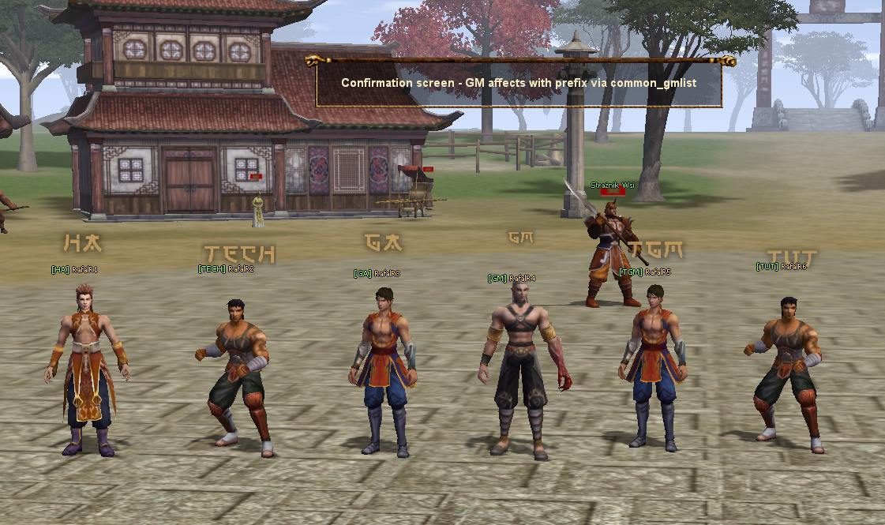

# RAFALR-METIN-GM-AFFECTS-SYSTEM

Distinct GM affects and visible staff prefixes for Martysama serverfiles.



External example: https://metin2.download/picture/YJeeJ4r2rXR337Pn6a76D2cyj7c1bP29/.jpg

## Polski

### Opis

System dodaje osobne efekty GM dla wybranych rang administracji oraz pokazuje nad postacia gracza prefix, np. `[HA]`, `[TECH]`, `[GA]`, `[GM]`, `[TGM]`, `[TUT]`, zamiast standardowego poziomu postaci.

Rozwiazanie zostalo przygotowane z pomoca sztucznej inteligencji na podstawie publicznego tematu spolecznosci. Patch jest przygotowany pod Martysama serverfiles.

Najwazniejsza zmiana polega na oddzieleniu wygladu GM od poziomu uprawnien administratora. Poziom uprawnien dalej pozostaje w kolumnie `mAuthority`, a za sam prefix oraz efekt odpowiada nowa kolumna `prefix` w tabeli `gmlist`.

### Funkcje

- osobny efekt wizualny dla prefixow `HA`, `TECH`, `GA`, `GM`, `TGM`, `TUT`
- prefix nad postacia GM zamiast poziomu postaci
- niezalezny prefix wizualny bez zmiany realnych uprawnien GM
- domyslny prefix `GM`
- odswiezanie efektu po zmianie listy GM
- gotowe snippety dla serwera, binarki klienta, roota i locale

### Struktura paczki

- `server/gmlist.sql` - zapytanie SQL dodajace kolumne `prefix`
- `svn/server/common` - zmiany dla `CommonDefines.h` i `tables.h`
- `svn/server/db` - zmiany dla pobierania listy GM z bazy
- `svn/server/game` - affecty, prefix GM, odswiezanie efektu i obsluga postaci
- `svn/client/UserInterface` - define, ID affectow, eksport do Pythona i wyswietlanie prefixu
- `client/root` - rejestracja efektow i sciezki locale
- `client/locale/xx/effect` - miejsce na pliki `.mse` i `.tga` efektow

### Instalacja

1. Zrob kopie zapasowa zrodel serwera, zrodel klienta, plikow root/locale oraz bazy danych.

2. Wykonaj SQL z pliku `server/gmlist.sql` w bazie, w ktorej znajduje sie tabela `gmlist`:

```sql
ALTER TABLE gmlist
ADD COLUMN prefix ENUM('HA','TECH','GA','GM','TGM','TUT') NOT NULL DEFAULT 'GM' AFTER mAuthority;
```

3. W zrodlach serwera dodaj snippety z katalogu `svn/server` do odpowiednich plikow:

- `common/CommonDefines.h`
- `common/tables.h`
- `db/ClientManager.cpp`
- `game/src/affect.h`
- `game/src/char.cpp`
- `game/src/char.h`
- `game/src/gm.cpp`
- `game/src/gm.h`
- `game/src/input_db.cpp`

4. W zrodlach klienta dodaj snippety z katalogu `svn/client/UserInterface` do odpowiednich plikow:

- `Locale_inc.h`
- `InstanceBase.h`
- `InstanceBase.cpp`
- `InstanceBaseEffect.cpp`
- `PythonApplicationModule.cpp`
- `PythonCharacterModule.cpp`

5. W plikach root klienta dodaj snippety z katalogu `client/root`:

- `localeinfo.py`
- `playersettingmodule.py`

6. Dodaj pliki efektow do locale klienta:

```text
locale/<twoj_locale>/effect/ha.mse
locale/<twoj_locale>/effect/ha.tga
locale/<twoj_locale>/effect/tech.mse
locale/<twoj_locale>/effect/tech.tga
locale/<twoj_locale>/effect/ga.mse
locale/<twoj_locale>/effect/ga.tga
locale/<twoj_locale>/effect/gm.mse
locale/<twoj_locale>/effect/tgm.mse
locale/<twoj_locale>/effect/tgm.tga
locale/<twoj_locale>/effect/tut.mse
locale/<twoj_locale>/effect/tut.tga
```

7. Przebuduj `game`, `db` oraz binarke klienta, a nastepnie spakuj ponownie `root` i `locale`.

8. Zrestartuj serwer albo przeladuj liste GM, jezeli Twoje pliki obsluguja reload administracji.

### Uzycie

Prefix ustawiasz w tabeli `gmlist`, niezaleznie od `mAuthority`.

Przyklad:

```sql
UPDATE gmlist
SET prefix = 'HA'
WHERE mName = 'NickGM';
```

Dostepne wartosci:

```text
HA, TECH, GA, GM, TGM, TUT
```

Jezeli kolumna `prefix` jest pusta lub nie zostanie ustawiona, system uzyje domyslnego prefixu `GM`.

### Wazne uwagi

- `mAuthority` dalej odpowiada za realne uprawnienia administratora.
- `prefix` odpowiada tylko za wyswietlany tag oraz efekt wizualny.
- ID affectow po stronie klienta sa celowo przesuniete o `-1` wzgledem serwera. Nie zmieniaj ich bez sprawdzenia mapowania flag affectow.
- Jezeli zmieniasz nazwy prefixow, zaktualizuj rownoczesnie SQL, `RefreshGMAffect`, pliki root i rejestracje efektow.
- Pliki `.mse` moga wymagac dodatkowych tekstur. Upewnij sie, ze wszystkie zasoby wskazane w `.mse` znajduja sie w kliencie.

### Autor

Patch przygotowany przez RAFALR z wykorzystaniem wsparcia sztucznej inteligencji.

## English

### Description

This system adds distinct GM visual effects for selected staff prefixes and displays a staff prefix above the character, for example `[HA]`, `[TECH]`, `[GA]`, `[GM]`, `[TGM]`, `[TUT]`, instead of the normal character level.

The solution was developed with the help of artificial intelligence and based on a public community topic. This patch was created for Martysama serverfiles.

The main idea is to separate the visual GM affect from the administrator permission level. The real permission level still stays in the `mAuthority` column, while the displayed prefix and visual effect are controlled by the new `prefix` column in the `gmlist` table.

### Features

- separate visual affect for `HA`, `TECH`, `GA`, `GM`, `TGM`, `TUT`
- staff prefix above the GM character instead of the character level
- visual prefix separated from real GM permissions
- default `GM` prefix
- affect refresh after GM list reload
- ready snippets for server source, client source, root and locale

### Package Structure

- `server/gmlist.sql` - SQL query adding the `prefix` column
- `svn/server/common` - changes for `CommonDefines.h` and `tables.h`
- `svn/server/db` - changes for loading the GM list from the database
- `svn/server/game` - affects, GM prefix, affect refresh and character handling
- `svn/client/UserInterface` - define, affect IDs, Python exports and prefix display
- `client/root` - effect registration and locale paths
- `client/locale/xx/effect` - place for `.mse` and `.tga` effect files

### Installation

1. Make a backup of your server source, client source, root/locale files and database.

2. Execute the SQL from `server/gmlist.sql` in the database where your `gmlist` table exists:

```sql
ALTER TABLE gmlist
ADD COLUMN prefix ENUM('HA','TECH','GA','GM','TGM','TUT') NOT NULL DEFAULT 'GM' AFTER mAuthority;
```

3. Add the snippets from `svn/server` to the matching server source files:

- `common/CommonDefines.h`
- `common/tables.h`
- `db/ClientManager.cpp`
- `game/src/affect.h`
- `game/src/char.cpp`
- `game/src/char.h`
- `game/src/gm.cpp`
- `game/src/gm.h`
- `game/src/input_db.cpp`

4. Add the snippets from `svn/client/UserInterface` to the matching client source files:

- `Locale_inc.h`
- `InstanceBase.h`
- `InstanceBase.cpp`
- `InstanceBaseEffect.cpp`
- `PythonApplicationModule.cpp`
- `PythonCharacterModule.cpp`

5. Add the snippets from `client/root` to the client root files:

- `localeinfo.py`
- `playersettingmodule.py`

6. Add the effect files to your client locale:

```text
locale/<your_locale>/effect/ha.mse
locale/<your_locale>/effect/ha.tga
locale/<your_locale>/effect/tech.mse
locale/<your_locale>/effect/tech.tga
locale/<your_locale>/effect/ga.mse
locale/<your_locale>/effect/ga.tga
locale/<your_locale>/effect/gm.mse
locale/<your_locale>/effect/tgm.mse
locale/<your_locale>/effect/tgm.tga
locale/<your_locale>/effect/tut.mse
locale/<your_locale>/effect/tut.tga
```

7. Rebuild `game`, `db` and the client binary, then repack `root` and `locale`.

8. Restart the server or reload the GM list if your files support admin reload.

### Usage

Set the prefix in the `gmlist` table independently from `mAuthority`.

Example:

```sql
UPDATE gmlist
SET prefix = 'HA'
WHERE mName = 'GMName';
```

Available values:

```text
HA, TECH, GA, GM, TGM, TUT
```

If the `prefix` column is empty or not configured, the system falls back to the default `GM` prefix.

### Important Notes

- `mAuthority` still controls the real administrator permission level.
- `prefix` controls only the displayed tag and the visual affect.
- Client-side affect IDs are intentionally shifted by `-1` compared to the server-side IDs. Do not change them without checking the affect flag mapping.
- If you change prefix names, update the SQL, `RefreshGMAffect`, root files and effect registration at the same time.
- `.mse` files may require additional textures. Make sure every asset referenced by the `.mse` files exists in the client.

### Credits

Patch prepared by RAFALR with the support of artificial intelligence.
